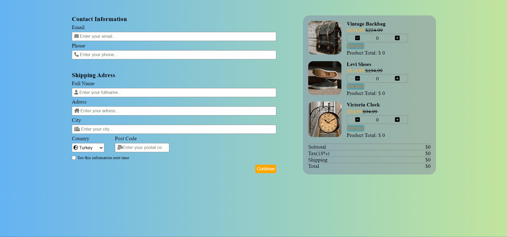

[👉 click here to view the page](https://msaiduslu.github.io/Checkout-Page/)

# Project : Checkout Page

## Description

Project aims to create a real checkout page of e-commerce website.

### At the end of the project, i will be able to;

- analyze a problem, create e-commerce website page.

- demonstrate their knowledge of algorithmic design principles for dynamic calculation of product's cart.

## Project Skeleton

```
Checkout_Page (folder)
|
|----readme.md
|----img(folder)
|----index.html
|----style.css
|----App.js
```

- User stories;

  - When I click plus button on product's row, I can increase the product's quantity.
  - When I click minus button on product's row, I can decrease the product's quantity, but minimum quantity value can be 1.
  - When I click remove button on product's row, I can delete a product in the cart.
  - When I change any combination of product chart(plus, minus, remove etc.), I want to see the new calculation of chart's prices in concerned fields.
